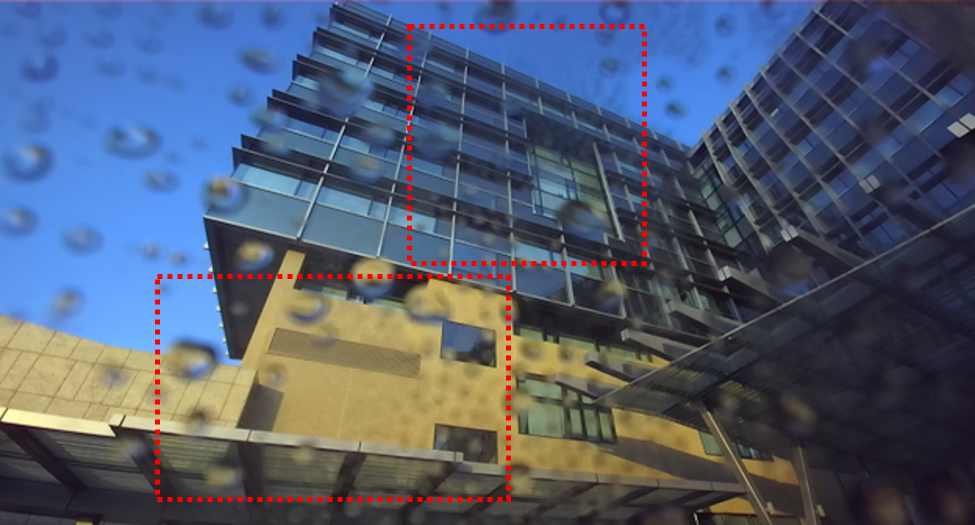

# Stereo-Waterdrop-Removal-with-Row-wise-Dilated-Attention

**This repository includes official codes for "[Stereo  Waterdrop  Removal  with  Row-wise  Dilated  Attention (IROS2021)](https://arxiv.org/abs/2108.03457)".** 

> **Stereo  Waterdrop  Removal  with  Row-wise  Dilated  Attention** <br>
>  Zifan Shi, Na Fan, Dit-Yan Yeung, Qifeng Chen <br>
>  HKUST <br>

[[Paper](https://arxiv.org/abs/2108.03457)] 
[[Datasets](https://hkustconnect-my.sharepoint.com/:f:/g/personal/zshiaj_connect_ust_hk/EuK1F-9M5EtKshqLeKVCsUABMjImaV14jiizgjjUuw4GIQ?e=Piuckp)] 


## Introduction
Existing vision systems for autonomous driving or robots are sensitive to waterdrops adhered to windows or camera lenses. Most recent waterdrop removal approaches take a single image as input and often fail to recover the missing content behind waterdrops faithfully. Thus, we propose a learning-based model for waterdrop removal with stereo images. A real-world dataset that contains stereo images with and without waterdrops is provided to benefit the related research.

 

 

## Installation
Clone this repo.
```bash
git clone https://github.com/VivianSZF/Stereo-Waterdrop-Removal.git
cd Stereo-Waterdrop-Removal/
```

We have tested our code on Ubuntu 18.04 LTS with PyTorch 1.6.0 and CUDA 10.2. Please install dependencies by
```bash
conda env create -f environment.yml
```

## Datasets
The dataset can be downloaded from the [link](https://hkustconnect-my.sharepoint.com/:f:/g/personal/zshiaj_connect_ust_hk/EuK1F-9M5EtKshqLeKVCsUABMjImaV14jiizgjjUuw4GIQ?e=Piuckp). 

'train', 'val' and 'test' refer to training set, validation set and test set captured by ZED 2. 'test_mynt' contains test images from MYNT EYE camera. In each folder, '000' denotes the waterdrop-free image (Ground truth). 'xxx_0' is the left image while 'xxx_1' is the right image. The dataset can be put under the 'dataset' folder.

## Training
The arguments for training are listed in `train.py`. To train the model, run with the following code
```bash
sh train.sh
```
The checkpoints and the validation ressults will be saved into `./result/{exp_name}/train/`. 


## Test
 Download the pretrained [checkpoints](https://hkustconnect-my.sharepoint.com/:f:/g/personal/zshiaj_connect_ust_hk/EsgVIyTn6jZBuVuEp3vGHTkBo3-_nbKWlQLCkrSRMBxqSA?e=BLXFOp) and put them under `./result/{exp_name}/train/`. The arguments for test are listed in `test.py`. You can specify them in `test.sh` and run the command
```bash
sh test.sh
```
The output images are available under `./result/{exp_name}/test/`

## Citation

```
@inproceedings{shi2021stereo,
  title = {Stereo Waterdrop Removal with Row-wise Dilated Attention},
  author = {Shi, Zifan and Fan, Na and Yeung, Dit-Yan and Chen, Qifeng},
  booktitle = {IROS},
  year = {2021}
}
```

## Contact
Please contact me if there is any question (Zifan Shi, vivianszf9@gmail.com).
